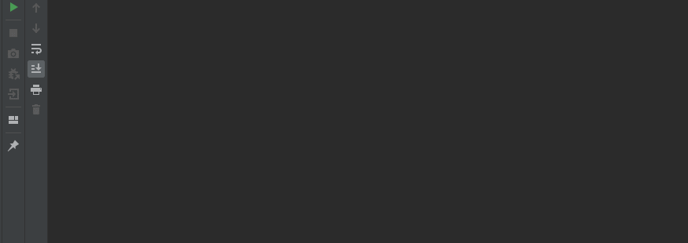

# Brute-force

The program uses a full search algorithm to find five-letter passwords corresponding to the following hash values and SHA-256 and displays them on the screen:
Hash values are read from the file

The program iterates through all possible passwords consisting of only five lowercase letters of the English ASCII alphabet.

The program has the ability to run the iteration in single-threaded mode and in multithreaded mode, the number of threads is set by the user. For each mode, the time spent on selection is displayed.

